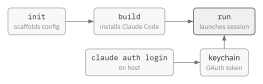
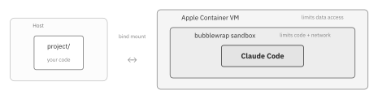

#+date: 2026-04-05
#+description: Using Apple Containers and Claude Code's sandbox to isolate AI agents from sensitive data, arbitrary code execution, and unrestricted network access.

* My Claude Code Sandbox

I use [[https://kiro.dev/cli/][Kiro]] at work and [[https://code.claude.com/docs/en/overview][Claude Code]] on weekends, and occasionally tinker with Cursor, Codex, Pi, and
others. The interfaces matter less than the models, but babysitting these tools with =Do you want
<Tool> to do <X>?= is a problem. As Claude Code's current documentation puts it:

#+begin_quote
By default, Claude Code requests permission for actions that might modify your system: file writes,
Bash commands, MCP tools, etc. This is safe but tedious. After the tenth approval you're not really
reviewing anymore, you're just clicking through.

-- [[https://code.claude.com/docs/en/best-practices#configure-permissions][Configure Permissions, Claude Code]]
#+end_quote

Agents are tenacious and even mild prodding can push them to seek unintended goals in [[https://ona.com/stories/how-claude-code-escapes-its-own-denylist-and-sandbox][creative ways]].
If they have access to sensitive data, can run arbitrary code, and can access remote endpoints, we
have a problem. I am not cool enough for =--dangerously-skip-permissions= yet so I built a sandbox
that filters the annoying permission prompts.

** Setup

There are many ways to do this. You can isolate your agent with kernel backed solutions like
[[https://landlock.io][landlock]], [[https://github.com/containers/bubblewrap][bubblewrap]], or [[https://theapplewiki.com/wiki/Dev:Seatbelt][seatbelt]]. That works well but requires a bunch of /can do this, can't do
that/ [[https://nono.sh/docs/cli/clients/claude-code][profile]] management. You can skip all that by running the tool in a virtual machine isolated
from your sensitive data. Or you can, like I do, use both. Particularly, on the latest macOS, where
you can use Apple's recent [[https://developer.apple.com/documentation/virtualization][virtualization]] framework, the combination gives a neat workflow.

You need a recent Mac (Apple Silicon, macOS Tahoe) with the [[https://github.com/apple/container][=container=]] CLI installed. Once you have
those, you can install my [[https://github.com/aldrin/claude-sandbox][=claude-sandbox=]] with Cargo:

#+begin_src sh
cargo install --git https://github.com/aldrin/claude-sandbox.git
#+end_src

The [[https://github.com/aldrin/claude-sandbox/blob/main/README.md][README]] has the details, but the workflow is straightforward.

#+name: fig-sandbox
#+caption: The claude-sandbox workflow.

I go into a project I need AI assistance with and run =claude-sandbox init= to scaffold a
=.claude-sandbox/= folder with the container configuration. Then I run =claude-sandbox build= to
build the container image and =claude-sandbox run= to start a Claude Code session and work as usual.

The =build= step installs the latest Claude Code into the image and configures its sandbox
settings. The only use for Claude on the host-side is running =claude auth login= to populate the
OAuth token. At runtime, =claude-sandbox run= reads it from the host keychain and passes it to the
Claude Code in the container.

** Containing the data

=claude-sandbox run= launches Claude Code inside an [[https://github.com/apple/containerization][Apple Container]]. Each container runs in its own
lightweight VM using Virtualization.framework on Apple Silicon, so isolation happens at the VM
boundary rather than through kernel namespaces. The container mounts only the project directory I
started it in. The agent has no path to any other file on my machine. I pick what to share by
picking where to run the tool.

#+name: fig-sandbox-runtime
#+caption: Isolation layers at runtime.

** Containing the code

Inside the container, =claude-sandbox= configures Claude Code's [[https://code.claude.com/docs/en/sandboxing][Bash sandbox]]. With
=autoAllowBashIfSandboxed= on, most Bash commands run without approval prompts. The =acceptEdits=
permission mode lets the agent write files freely within the mounted directory. Under the hood,
[[https://github.com/containers/bubblewrap][bubblewrap]] restricts Bash commands to the mounted project directory and blocks network access to
domains not on the allowlist. Every Bash command and its child processes inherit these restrictions,
so if the agent goes off track, the damage stays contained.

** Containing the network

All network traffic routes through local proxies. Anthropic's [[https://www.anthropic.com/engineering/claude-code-sandboxing][engineering post]] describes the design:
HTTP, HTTPS, and SOCKS traffic go through proxy servers on localhost. DNS resolution and direct TCP
connections to external hosts are blocked. When the agent tries to reach a domain not on the
allowlist, the request goes to Claude Code's permission system and I see a prompt.

** The workflow

While the agent works in the sandbox, the project directory is a bind mount, so changes appear on my
host filesystem in real time. I keep my own editor and git workflow. When the session ends, the
container goes away, but the work remains in my git workspace to review and publish.

With this workflow, most permission prompts disappear. I still see some when the agent wants to do
things like reach out to a new domain. I don't mind those because their the agent is typically doing
things I do want to review. At least until I am cool enough for =--dangerously-skip-permissions=.
