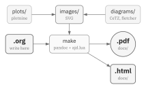
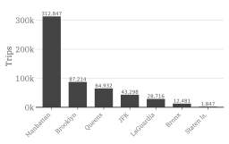
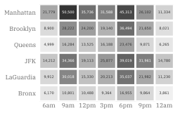

#+date: 2026-03-29
#+description: A personal publishing pipeline using Emacs Org-mode, pandoc, Typst, and IBM Plex fonts to produce PDF and HTML documents.

* My Writing System

I write in Emacs [[https://orgmode.org][org-mode]] and publish documents as both PDF and HTML. This repository contains
my writing system, built on [[https://pandoc.org][pandoc]] and [[https://typst.app][typst]]. If you find it useful, you are welcome
to use it too. I use macOS but this should work on Linux with minor tweaks.

To get started, you can use =./setup.sh= to install the tools I use (pandoc, typst, uv, and the IBM
Plex fonts). Write your content in an =.org= file, place any images in =images/=, and run =make= to
produce both outputs.

#+name: fig-pipeline
#+caption: The rendering pipeline from Org source to PDF and HTML.

Each =.org= file produces both a PDF and an HTML page. The Lua filter (=ajd.lua=) handles the
format-specific details. For PDF, it writes Typst markup that the template (=style/ajd.typ=)
compiles into =docs/=. For HTML, it inlines SVG images and numbers figures and tables so each page
is self-contained. Run =make site= to build everything at once.

The author defaults to yours truly and the date defaults to the build date. Override either in the
Org file header with =#+author:= or =#+date:=. Setting either to blank suppresses it in the output.

Some choices here are opinionated. The PDF has line numbers in the left margin, useful when
reviewers need to reference specific lines. The palette is grayscale throughout. None of this is
hard to change. Point your favorite AI coding agent at the template and stylesheet and make it
yours.

** Document elements

The rest of this page walks through the elements I typically use in my documents. You can read the
[[https://github.com/aldrin/pages/blob/main/stationery.org?plain=1][Org source]] to see how each one is written. Text can be *bold*, /italic/,
_underlined_, +struck through+, or =inline code=. Links render in color, like [[https://www.poetryfoundation.org/poems/46271/i-am-a-parcel-of-vain-strivings-tied][this one]].
Footnotes render at the bottom of the page with a short separator rule [fn:1]. Block quotes look
like the following:

#+begin_quote
I am a parcel of vain strivings tied by a chance bond together.

-- Henry David Thoreau
#+end_quote

Any data-driven narrative needs tables. Org tables are simple to write and render well in both
outputs. The table below uses sample NYC taxi data to show the booktabs style, horizontal rules
only:

#+name: tbl-taxi
#+caption: NYC Taxi Trip Metrics by Borough (2024 Q1)
| Borough       | Trips   | Avg Fare | Avg Distance | Avg Duration | Tip Rate |
|---------------+---------+----------+--------------+--------------+----------|
| Manhattan     | 312,847 | $14.20   | 2.3 mi       | 14.8 min     | 22.1%    |
| Brooklyn      | 87,214  | $18.50   | 3.7 mi       | 22.3 min     | 18.4%    |
| Queens        | 64,932  | $32.70   | 10.2 mi      | 34.1 min     | 16.9%    |
| Bronx         | 12,481  | $22.40   | 5.1 mi       | 24.7 min     | 14.2%    |
| Staten Island | 1,847   | $28.90   | 7.8 mi       | 28.5 min     | 12.8%    |
| JFK Airport   | 43,298  | $52.00   | 17.4 mi      | 42.6 min     | 19.7%    |
| LaGuardia     | 28,716  | $34.10   | 8.9 mi       | 26.3 min     | 20.3%    |

Visualizations make data easier to interpret. The Python scripts in =plots/= generate SVG charts
like the ones below, using the same grayscale style as the rest of the document.

#+begin_twocol
#+name: fig-taxi-trips
#+caption: Trip volume by borough.

-----
#+name: fig-taxi-heatmap
#+caption: Trip volume by borough and time of day.

#+end_twocol

You can refer to any table or figure using Org internal links. Give the element a =#+name:= and
write =[[#label]]= in your text. The numbers are assigned automatically: [[#tbl-taxi]],
[[#fig-taxi-trips]], [[#fig-taxi-heatmap]].

*** More features

Third level headings like this one are run-in headings. They flow into the paragraph text and are
useful for minor divisions without adding vertical space. Code blocks render with syntax
highlighting:

#+begin_src python
def fibonacci(n):
    a, b = 0, 1
    for _ in range(n):
        yield a
        a, b = b, a + b
#+end_src

Use =#+begin_twocol= for two-column
layouts. A horizontal rule (=-----=) marks the column break.

#+begin_twocol
The left side can contain narrative text or context that pairs with the content on the right.
-----
#+begin_aside
Asides (text in =#+begin_aside=) provide tangential context. They are visually quieter than key and
work well for background information that does not belong in the main text.
#+end_aside

#+end_twocol

All of this is just scaffolding. The difficult part is the writing itself, but with presentation out
of the way, I hope you have more time for that. Happy writing.

* Footnotes

[fn:1] Footnotes work well for citations, asides, and tangential details that would interrupt the
main narrative.
